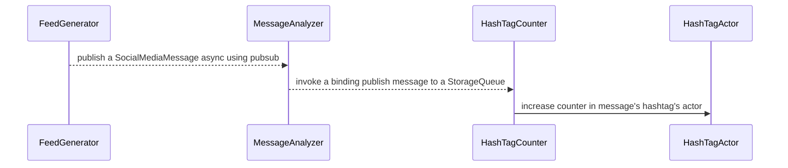

# Dapr Test Infra

This repo includes test apps and infrastructure tools.

* [Feed Generator](./feed-generator) : Test app for long haul test, contains feed-generator logic.
* [Message Analyzer](./message-analyzer) : Test app for long haul test, contains message-analyzer logic.
* [HashTag Counter](./hashtag-counter) : Test app for long haul test, contains hashtag-counter.
* [HashTag Actor](./hashtag-actor) : Test app for long haul test, hashtag-actor logic.
* [Pubsub Workflow](./pubsub-workflow) : Test app for long haul test, azure service bus pubsub logic.

# Solution overview and app dependency

