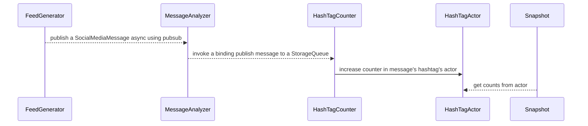

# Dapr Test Infra

This repo includes test apps and infrastructure tools.

* [Feed Generator](./feed-generator) : Test app for long haul test, contains feed-generator logic.
* [Message Analyzer](./message-analyzer) : Test app for long haul test, contains message-analyzer logic.
* [HashTag Counter](./hashtag-counter) : Test app for long haul test, contains hashtag-counter.
* [HashTag Actor](./hashtag-actor) : Test app for long haul test, hashtag-actor logic.
* [Pubsub Workflow](./pubsub-workflow) : Test app for long haul test, azure service bus pubsub logic.

# Solution overview and app dependency



TODO what about Pubsub Workflow ? who is publishing to it? And validation workflow?

# Deploying this application

## Locally with docker-compose or `dapr run -f`

TBD -- does it even work?

## On Azure Kubernetes Service (AKS)

Define the resource group we in which will we create the cluster and other resources and
the name of the cluster we will create.

```bash
export resourceGroup='myNewResourceGroup'
export location='eastus'
export clusterName='test-infra'
```

Create a resource group four your new cluster

```bash
az group create --name ${resourceGroup} --location ${location}
```

Deploy a cluster with test apps to this resource group:

```bash
az deployment group create --resource-group ${resourceGroup} --template-file ./deploy/aks/main.bicep --parameters "clusterName=${clusterName}"
```


Done! Explore your new AKS cluster with the sample applications

```bash
az aks get-credentials --admin --name ${clusterName} --resource-group ${resourceGroup}
```

## On Azure Container Apps (ACA)