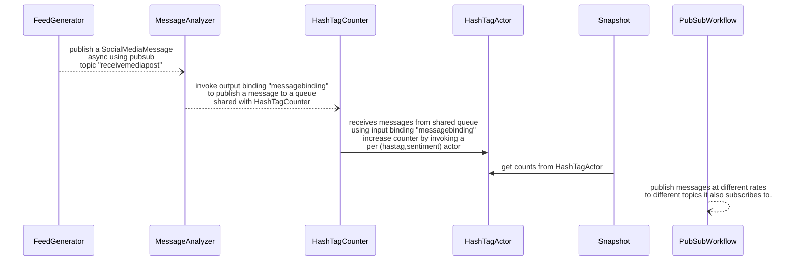

# Dapr Test Infra

This repo includes test apps and infrastructure tools.

Test apps for long haul tests:
* [Feed Generator](./feed-generator) : contains feed-generator logic. Exercises the pubsub component (publishing).
* [Message Analyzer](./message-analyzer) : contains message-analyzer logic. Exercises pubsub component (subscribing) and output binding.
* [HashTag Counter](./hashtag-counter) : contains hashtag-counter. Exercises input binding and actor component.
* [HashTag Actor](./hashtag-actor) : hashtag-actor logic. Exercises actor component. 
* [Pubsub Workflow](./pubsub-workflow) : azure service bus pubsub logic. Exercises pubsub component (publishing and subscribing).

Test analytics :
* [Test Crawler](./test-crawler) : A Python script scrapes the Dapr E2E tests results.

# Solution overview and app dependency



TODO what about Pubsub Workflow ? who is publishing to it? And validation workflow?

# Deploying this application

## Locally with Dapr Multi-App run

This is not properly a deployment, but it is a way to run all the longhaul applications locally using [Dapr Multi-App run](https://docs.dapr.io/developing-applications/local-development/multi-app-dapr-run/).


```bash	
# Start base components such as redis and zipkin, which we depend on
dapr init
# Start RabbitMQ which is used for our input/output binding tests.
docker run -d -p 5672:5672 --hostname dapr_rabbitmq --name dapr_rabbitmq rabbitmq:3-alpine
# Run all the apps
dapr run -f deploy/dapr-multi-app/dapr.yaml
```

## On Azure Kubernetes Service (AKS)

Define the resource group we in which will we create the cluster and other resources and
the name of the cluster we will create.

```bash
export resourceGroup='myNewResourceGroup'
export location='eastus'
export clusterName='test-infra'
```

Create a resource group four your new cluster

```bash
az group create --name ${resourceGroup} --location ${location}
```

Deploy a cluster with test apps to this resource group:

```bash
az deployment group create --resource-group ${resourceGroup} --template-file ./deploy/aks/main.bicep --parameters "clusterName=${clusterName}"
```


Done! Explore your new AKS cluster with the sample applications

```bash
az aks get-credentials --admin --name ${clusterName} --resource-group ${resourceGroup}
```

### Regaining control of your AKS cluster's Dapr setup.


Our AKS Bicep templates offer a convenient way to quickly start up an
AKS cluster running our longhaul applications for E2E testing.
In this setup, Dapr is installed on the AKS cluster by means of an AKS extension.
Using this extension is great if you want a fully managed Dapr setup on your AKS cluster.
However, its use puts some constraints on the user's ability to control
the installed Dapr setup.
Using Helm or `dapr init -k` directly to manage, upgrade or uninstall Dapr on your AKS cluster won't work.

If you want to fully control Dapr setup on your cluster, you need to uninstall the extension first:

```bash
az k8s-extension delete --resource-group ${resourceGroup} --cluster-name ${clusterName} --cluster-type managedClusters --name ${clusterName}-dapr-ext
```


Then you can re-install Dapr using Helm or `dapr init -k`:

```bash
export DAPR_VERSION_TO_INSTALL='1.11.3'
helm upgrade --install dapr dapr/dapr \
    --version=${DAPR_VERSION_TO_INSTALL} \
    --namespace dapr-system \
    --create-namespace \
    --wait
``` 

Don't forget to do a rolling restart in all apps to pick up the new manually-installed Dapr version: 😉

```bash
for app in "feed-generator-app" "hashtag-actor-app" "hashtag-counter-app" "message-analyzer-app" "pubsub-workflow-app" "snapshot-app" "validation-worker-app" "workflow-gen-app"; do
    kubectl rollout restart deploy/${app} -n longhaul-test || break
done 
```


## On Azure Container Apps (ACA)