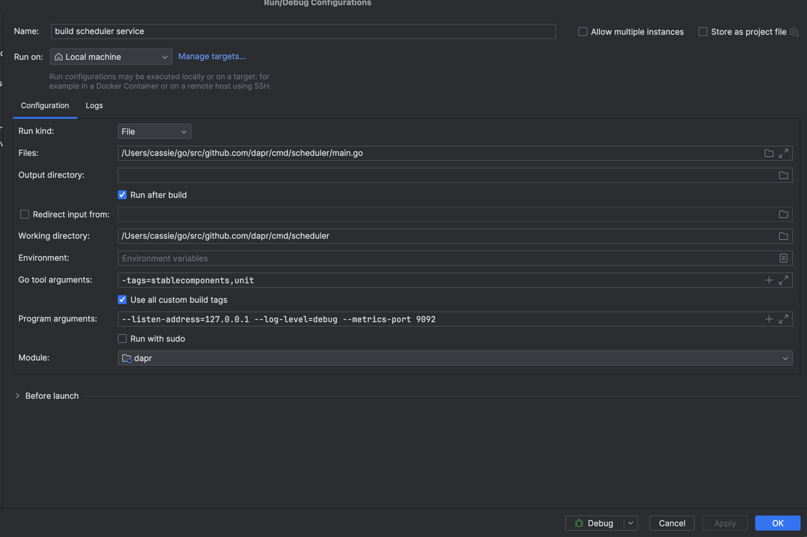
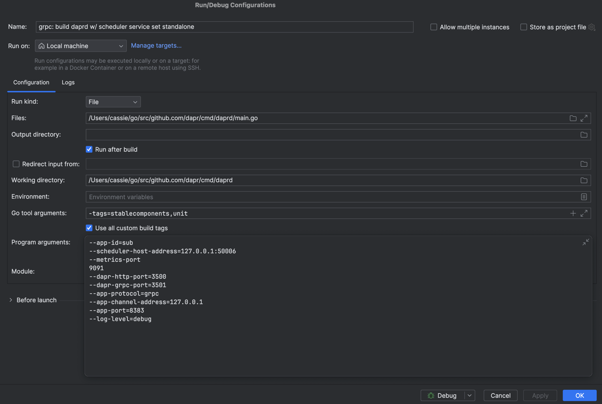

# How-To Run Locally:

To run locally as a process: `go run scheduler-jobs.go`, assuming you have a scheduler and dapr running accordingly (see below).

Run Scheduler:


Run Dapr sidecar:


To run locally as a container:
```shell
docker build -t scheduler-jobs .
docker run -p 8383:8383 --name scheduler-jobs scheduler-jobs # optionally add -d to run in background
# check container is running
docker ps
```